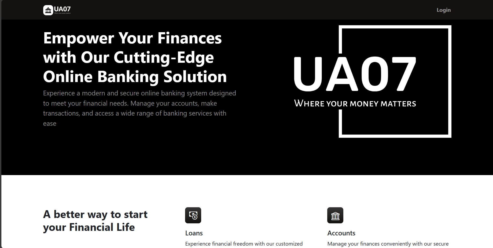
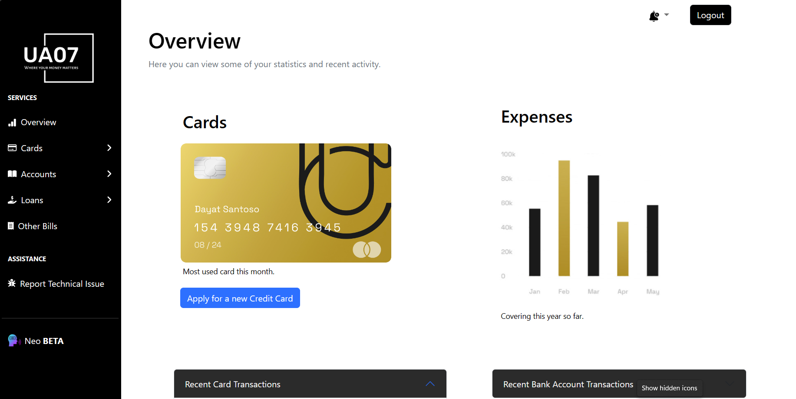
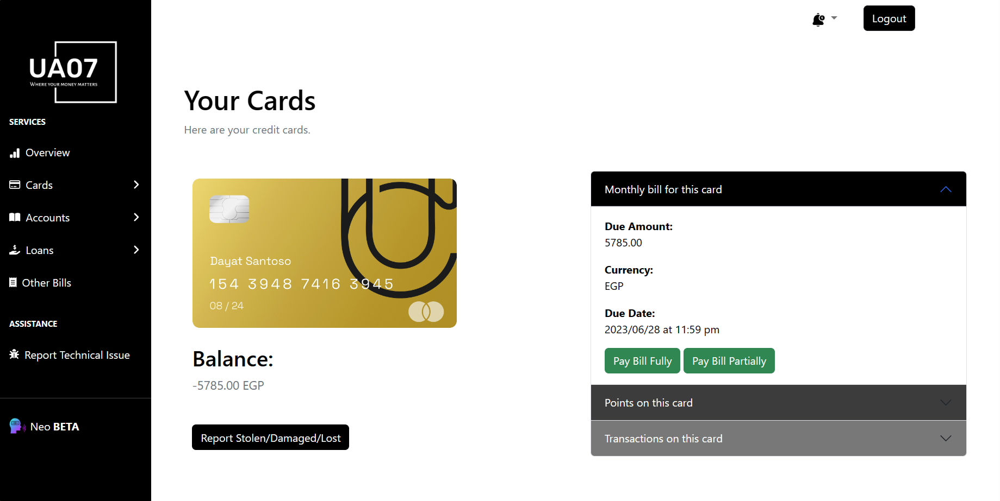
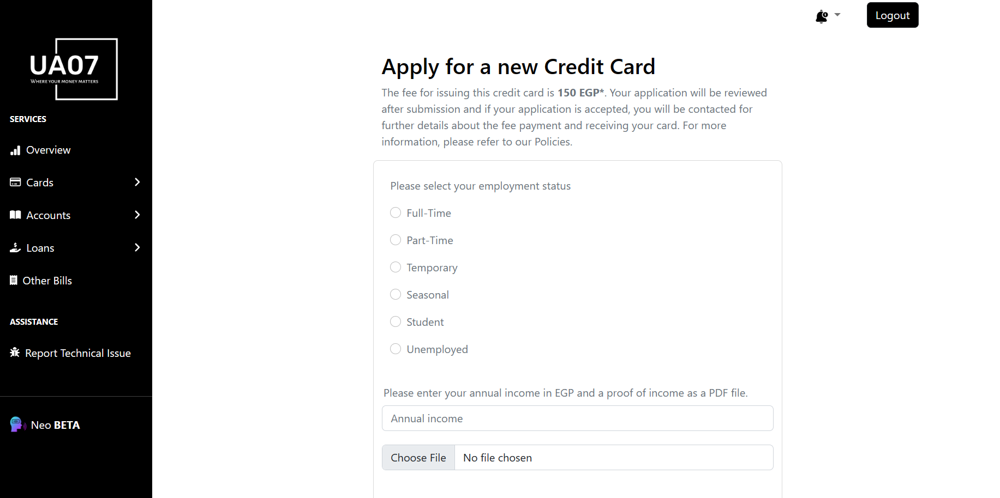
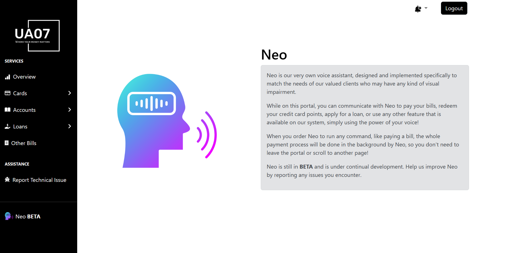

# Online Banking Platform

An online banking web application that allows **_Clients_** to create and manage bank accounts, credit cards and loans, **_Bankers_** to review and handle loan and credit card applications, and **_Admins_** to manage the system and handle reported issues.

## Screenshots











## Getting Started

### Clone the repository

To get started, clone the repository by running the following command:

```bash
git clone https://github.com/software-engineering-2023/Online-Banking-Platform.git
```

### Login credentials

Next, navigate to the login page and login using the following credentials:

#### Client

Username: `ClientUserName`  
Password: `ClientPassword`

#### Banker

Username: `BankerUsername`  
Password: `BankerPassword`

#### Admin

Username: `SystemAdminUsername`  
Password: `SystemAdminPassword`

## Tech Stack

- HTML
- CSS
- JavaScript
- jQuery
- Bootstrap 5
- Fontawesome
- VSCode
- Git
- GitHub

## Authors

- [@MoTammaa](https://github.com/MoTammaa)
- [@mahmoudaboueleneen](https://github.com/mahmoudaboueleneen)
- [@AbdelrahmanRewaished](https://github.com/AbdelrahmanRewaished)
- [@abdelrahmanAbouelkheir](https://github.com/abdelrahmanAbouelkheir)
- [@Ahmedsherif74](https://github.com/Ahmedsherif74)
